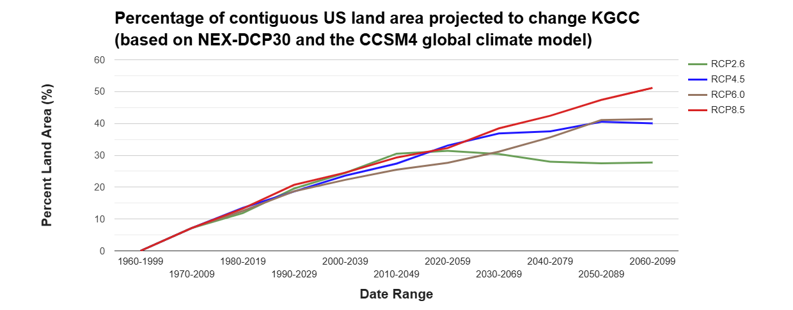

# Summary

This work presents a codebase for calculating and visualizing the Köppen-Geiger (KGCC) climate classification in Google Earth Engine (GEE). The KGCC has thirty global climate type definitions that use thresholds of seasonal temperature and precipitation to delineate geographic regions with similar climate. The codebase includes a template for creating KGCC maps that can be applied to numerous publicaly available climate datasets. The template is accessible through a basic Python GEE package and is part of a GEE hosted web application for KGCC viewing, the code for which is made available so that a user has the ability launch their own instance of the app in the GEE Online Code Editor and modify and adapt the code to other datasets or other features. The web application visualizes KGCC maps derived from climate projections to predict how KGCC regions may change over time based on the high-resolution NEX-DCP30 dataset for the CMIP5 ensemble of global climate models (GCMs), in this case with coverage of the contiguous US. Taking advantage of the ability to process large collections of climate images in GEE, ensemble-based uncertainty maps can be viewed that quantify the likelihood of a climate type existing at a given time and location. In addition to being a generalized characterization of climate, resulting KGCC visualizations are a means of understanding the range of outcomes given by GCMs and climate scenarios. As an example of a use-case, an analysis was done to estimate the percentage of land in the US that is projected to see a transition in climate type, having implications for land management, agriculture, and other climate dependent sectors.

# Statement of need

Climate datasets are often very large and require intensive processing to derive factors of interest. However, decision-makers often lack the resources and ability to do such processing. Therefore, it becomes desirable to have a web platform available to access relevant information [@hewitson2017]. The Köppen-Geiger climate classification (KGCC) is one such climate factor that delineates global climate types and provides a general characterization of climate [@beck2023]. The KGCC was developed to be correlative with vegetation communities, and therefore, it often coincides with ecosystem regions. Also, KGCC is a factor that can be applied in the context of climate change because it is determinable for historical and future periods alike. As such, using KGCC in the decision-making process can allow for consideration of standardized climate projections and other datasets.

The computational resources of GEE are an advantage by quickly processing large climate datasets, enabling assessment of a range of outcomes given by GCM ensembles and various fossil fuel emission scenarios [@gorelick2017]. This is particularly useful for determining ensemble statistics and deriving uncertainties that allow for a more comprehensive assessment of risk and better justification of decisions. Another benefit of GEE is that calculations done by this codebase are generally fast enough to be performed on-the-fly, which means that it is not necessary for client-side storage of outputs.

# Köppen-Geiger climate classification

The Köppen-Geiger Climate Classification (KGCC) is a widely used global climate classification first developed by Wladimir Köppen in the 19th century and later refined by Rudolf Geiger [@kottek2006]. The KGCC requires input data with at least monthly-scale temporal resolution to calculate 30 global climate types. Generally, a minimum reference period of 30 years should be used in order to represent climate. According to KGCC, there are 5 main divisions of climate: tropical (A), arid (B), temperate (C), continental (D), and polar (E) that correspond to the first letter in the labeling scheme. Then, these are further divided into second and third-order classifications (indicated by the number of letters in their respective labels). Divisions are made using a number of temperature and precipitation thresholds in monthly and annual factors. This requires the data to be statistically reduced in different ways, such as by season, by maximum and minimum monthly or seasonal values, by average annual precipitation, and other intermediate statistical values. Literature works involving KGCC commonly include definitions of individual climate types, e.g., @peel2007 and @beck2023, and additionally, @kottek2006 have good discussion of strategy for calculating the entire classification. In minor instances where published KGCC criteria differ from one another, the criteria of @beck2023 were used.

# The GEE-KGCC codebase

The [GEE-KGCC](https://github.com/ARS-SWRC/GEE-KGCC) codebase includes a Python package for creating KGCC maps using the GEE API, as well as related scripts for processing different high-resolution, monthly-scale climate datasets freely available on GEE. Other datasets may be similarly applied, including datasets with other temporal resolutions, such daily-scale, if they are first aggregated to monthly-scale images. The demonstrated climate datasets were selected primarily because they have at least \~10 km spatial resolution, which makes them ideal for showing climate gradients over small distances. The `minimal_classification.js` script makes use of the global WorldClim dataset that, in the GEE catalog, is already monthly averaged for a 31-year period [@hijmans2005]. This reduces the pre-processing steps needed to prepare the inputs, such that the script primarily shows code that can be applied in the same way to other input datasets. Therefore, this script represents a minimal example for general applications. A more detailed Python notebook that makes use of the geekgcc package, `multi-dataset-notebook.ipynb`, prepares the inputs for five different climate datasets and allows maps to be downloaded and visualized. The `geekgcc_test.ipynb` notebook further allows the functionality of geekgcc to be tested.

# Determining KGCC by processing climate images

To illustrate the strategy for processing KGCC in GEE, the following code snippet delineates the third-order BSk climate (cold semi-arid) as an example. This climate type is common globally and contains rangeland and steppe environments. The snippet shows use of intermediate images for applying the criteria of each type, which will be described in-text. Otherwise, the code snippet shows only the final steps necessary for delineating the higher order types and BSk itself.

```js
//E
var e_im = tw_im.lt(10.0);

//B
var sin_e_im = tw_im.gte(10.0);
var con_b_im = zero_im.where(pann_im.lt(pthr_im.multiply(10.0)), 1);
var mix_im = con_b_im.add(sin_e_im);
var b_im = mix_im.eq(2.0);

//BS  
var con_bs_im = zero_im.where(pann_im.gt(pthr_im.multiply(5.0)), 1);
var mix_im = b_im.add(con_bs_im);
var bs_im = mix_im.eq(2.0);

//BSk
var con_bsk_im = zero_im.where(tann_im.lt(18.0), 1);
var mix_im = bs_im.add(con_bsk_im);
var bsk_im = mix_im.eq(2.0);
```

The main E division (polar and high mountain climates) is delineated first because its criteria exclude thresholds for precipitation and only a temperature threshold involving the average temperature of the warmest calendar month (`tw_im`) is used, resulting in potential overlap with other types. Therefore, the main B division, being arid climates, is considered present where the criteria for B are met (represented in the binary image, `con_b_im`) and where type E is not already present (the absence of E is represented in the binary image, `sin_e_im`). The integer image, `mix_im`, is the summation of the two binary images, such that type B is present where `mix_im` is equal to 2, and a binary image representing this condition, `b_im`, is created. The `zero_im` image is used as the initial blank binary image with only zero integer values onto which the binary conditions of each division are added.

The first and second-order divisions for B involve thresholds for a seasonal dryness metric, `p_thr_im`, such that BS is defined as having annual precipitation, `pann_im`, between upper and lower limit values of this metric. Finally, the third-order division depends on thresholds for mean annual temperature, `tann_im`. In this way, BSk and the other sub-divisions are delineated by creating binary images representing threshold conditions at each division that are then summed to determine overlapping areas where all conditions are met. The map panels in Figure 1 show the binary images that are created for E, B, BS, and BSk in respective panels.

# Spatial analysis with KGCC maps

The `GEE-KGCC` codebase includes `spatial_analysis_trends.js`, which creates a chart of a basic spatial analysis for obtaining information from KGCC maps in the context of climate change. Shown in Figure 2, the purpose of this analysis is to show the timeline of transitions in climate type occurring within a given area. In this case, the entire coverage area of NEX-DCP30 is analyzed (being the contiguous US) and includes the outputs of one GCM and four climate scenarios [@thrasher2013]. Note that it is possible to change the processing extent in `spatial_analysis_trends.js` so that the same analysis can be repeated for a selected area of interest. Overall totals for KGCC transitions are shown in the top panel of Figure 2.

By providing a range of trends according to different emission scenarios known as Representative Concentration Pathways (RCPs), uncertainty bounds can be reasonably estimated, aiding the understanding of the range of outcomes. Note that in the top panel of Figure 2, these values are substantially greater than reported in the main results of @beck2023 in their global analysis of KGCC for climate projections because their analysis considered a different dataset and showed change occurring across only the 5 major climate types instead of across any of the 30 sub-order types. It is also possible that the US experiences greater rates of change in climate type than what occurs globally due to the high diversity of climates. Although, in the eastern US, some have noted lack of specificity in KGCC definitions for temperate and humid climates, and modified climate classifications, such as the Köppen–Trewartha climate classification, have been developed to address this issue [@belda2014].

# Web application

The GEE online code editor platform has basic widgets in its API for creating an Earth Engine hosted web application. Included code demonstrates this possiblility and was used to produce the following application:

[https://deductive-water-293819.projects.earthengine.app/view/koppen-climate-map](https://deductive-water-293819.projects.earthengine.app/view/koppen-climate-map). 

This application visualizes U.S. ensemble climate change projections in the NEX-DCP30 dataset. An instance of the application can also be launched in the online GEE code editor, giving the user the ability to modify the code to adapt other climate datasets or features. The app features are aimed at enabling the user to do basic analysis for an area of interest and understanding the GCM ensemble and related uncertainties.

The following are the main features included in the app:
- Visualization of NEX-DCP30 U.S. Ensemble Climate Projections.
- Ability to select GCM and climate trajectory. 
- Ability to select date range windows.
- View classification uncertainty.
- View classification timelines.

# Figures


Figure 1: KGCC delineation using the example of BSk climate, including intermediate binary maps and a final KGCC map. The panels are as follows: (a) map coverage area, (b) `e_im`, (c) `b_im`, (d) `bs_im`, (e) `bsk_im`, and (f) `type_im`, the final KGCC map showing the BSk classification as tan colored regions along with other KGCC types in the coverage area. The binary images represent conditions that isolate BSk going from higher order to lower order classifications.


Figure 2: Rates of change in land area classifications for a 140 year reference period with different RCPs represented. Timeline of change in any climate type in the KGCC including sub-orders.

# Acknowledgements

This work is a contribution of the USDA Southwest Climate Hub. Manuscript development was supported by the USDA, Agricultural Research Service, Rangeland Management Research Unit based at the Jornada Experimental Range with funding by the USDA (CRIS Project # 3050-11210-007D) and the Southwest Climate Hub (CRIS Project # 3050-12610-001-000D). This material is also based upon work supported by the US Department of Agriculture, Agricultural Research Service, under Agreement No. 58-2022-0-009. Any opinions, findings, conclusions, or recommendations expressed in this publication are those of the author(s) and do not necessarily reflect the view of the US Department of Agriculture. We acknowledge providers of open-access climate data, which were relied on to produce this work.

# References


