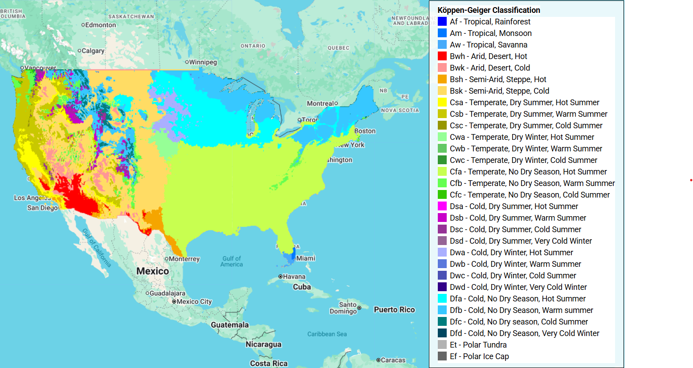

# GEE-KGCC



GEE-KGCC is a code base for calculating the Koppen-Geiger Climate Classification (KGCC), a widely used global climate classification, using the Google Earth Engine API (gee). The inputs are long-term average monthly precipitation and temperature. A simple Earth Engine package using the Python gee API is presented here, along with code for a web-based demonstration using an Earth Engine hosted website. This website has potential for adaptation to other features and climate datasets.

https://deductive-water-293819.projects.earthengine.app/view/koppen-climate-map

## Description
A Python-based package creates KGCC maps from monthly climate images prepared by the user. The gee dependency handles these images as Earth Engine image collection objects. Besides loading resulting KGCC maps to memory, the package can download KGCC geotif maps to Google Drive. Additionally, when the geemap library is installed, the maps may be visualized. 

## Requirements
- Google Account
- Google Earth Engine Account
- Python 3
- earthengine-api library
- geemap library (optional for visualization)

## Setup
In a default Google Colab environment, setup requirements are already met for installing geekgcc. The earthengine-api (ee) depency is automatically installed with geekgcc and in Colab. When using Colab, prepend an exclamation mark (!) to the beginning of the following two code lines.
**To install the geekgcc Python package using Git and Pip:**
```bash
git clone https://github.com/ARS-SWRC/GEE-KGCC
pip install GEE-KGCC/geekgcc_package
```
**To install the geekgcc Python package locally from a downloaded clone of the repository, use the following steps.** In an environment tool like conda, activate your Python environment and navigate to the top of the geekgcc_package sub-directory, which should contain a .toml file. Then, run the following Pip command:
```bash
pip install .
```
**For visualization, additionally install the geemaps library. In Colab, this library is pre-installed.**

Installation instructions may be found at:
https://geemap.org/

**To authenticate ee and import necessary libraries, use the following steps.** Start by importing, authenticating, and initializing ee, then import geekgcc.
```python
import ee
#This will open a web browser for log-in steps.
ee.Authenticate()
geeusername = 'yourusername' #Enter your GEE username.
ee.Initialize(project='ee-' + geeusername)
#ee should be initialized before importing geekgcc.
import geekgcc
```
The string argument for `ee.Initialize` assumes the default project name assigned by Earth Engine. If some other project name is used, modify the code accordingly. The web browser log-in steps may assist with creating and choosing a project, or a project may be created using the online ee code editor.

## Usage Notes
The user must provide `ee.ImageCollection` objects of long-term average monthly precipitation and temperature (12 images each). These should be overlapping images and should exist enitrely within a hemisphere (i.e., not in both hemispheres, such that at least two operations are needed to produce global coverage). WGS84 coordinate system is assumed in geekgcc. Climate images should be reprojected if they are in some other coordinate system.

**The following methods are included in geekgcc**: `classify()`, `download()`, `get_class_index()`, and `get_vis_params()`.

**Classification from monthly precipitation and tempearture raster images:**

`geekgcc.KGCC.classify(p_ic, t_ic, hemi)`

| Parameter | Type | Description |
| ------ | ------ | ------ |
| p_ic | ee.ImageCollection | 12 monthly precipitation images |
| t_ic | ee.ImageCollection | 12 monthly mean temperature images |
| hemi | string | "north" or "south" hemisphere |

Returns a classified `ee.Image` object. Possible output values are in the range from 1 to 30.

**Download classified image to Google Drive:**

`geekgcc.KGCC.download(type_image, geo, scale, filename)`

| Parameter | Type | Description |
| ------ | ------ | ------ |
| type_image | ee.Image | classified image |
| geo | ee.Geometry | bounding box geometry |
| scale | float | scale/resolution of downloaded image |
| filename | string | downloaded file name |

Returns `None`. Spawns a download task to Google Drive in geotif format. Download progress may be monitored in the Earth Engine Online Code Editor.

**Get visualization parameters:**

`geekgcc.KGCC.get_vis_params()`

| Parameter | Type | Description |
| ------ | ------ | ------ |
| - | - | - |

Returns a `dict` of visualization parameters including the minimum value (1), maximum value (30), and a commonly used color scheme for KGCC. Only needed when visualizing with geemaps.

**Get class look-up dictionary:**

`geekgcc.KGCC.get_class_index()`

| Parameter | Type | Description |
| ------ | ------ | ------ |
| - | - | - |

Returns a `dict` of class names and labels, along with corresponding numerical index values for 30 climate classes.

## Test Example
The `geekgcc_test.ipynb` notebook is available for testing functionality of geekgcc.

## Website Demonstration
The Earth Engine hosted website linked at the top was developed using entirely built-in functions available in the JavaScript version of earthengine-api through the online code editor: https://code.earthengine.google.com

This makes it possible for a user to paste the code from this website into the editor and launch their own instance of the app, perhaps with modifications to adapt a different climate dataset, or even with modifications to the app's features.

The main features are:
- Visualization of NEX-DCP30 U.S. Ensemble Climate Projections.
- Ability to select GCM and climate trajectory. 
- Ability to select date range windows.
- View classification uncertainty.
- View classification timelines.

Launching an instance of the app in the online code editor can be done in a two-step process. In the editor, paste the contents of Koppen-Climate-App.js and Koppen-Climate-MainFunc.js from the WebApp folder into the editor and save them as separate scripts using the same file names. The latter script is imported by the former script, and therefore, a line in former script needs to be modified to have the correct path.


